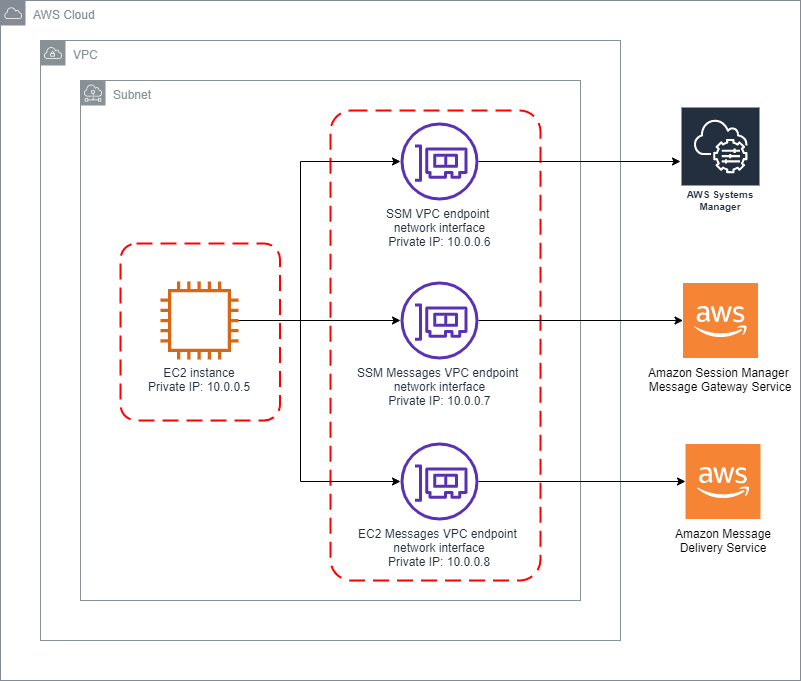

# Automated configuration of Session Manager without an internet gateway

## Prerequisites
1. Use a Region that offers the following VPC endpoints:
    - ssm
    - ssmmessages
    - ec2messages

## Architecture Diagram


## Steps
1. Create a CloudFormation stack from [session-manager-without-igw.yml](session-manager-without-igw.yml), specifying the following parameters:
    - Systems Manager Parameter for AMI
        - Specify the Parameter Store name of an AMI that includes the SSM agent. For example, ```/aws/service/ami-amazon-linux-latest/amzn2-ami-hvm-x86_64-gp2``` or ```/aws/service/ami-windows-latest/Windows_Server-2016-English-Full-Base```
    - CIDR block for VPC and subnet
        - Must be /28 or larger
    - EC2 Instance Type
        - Select a valid instance type for the Region
2. Select the EC2 instance from the AWS console and click the "Connect" button
3. Select "Session Manager" and click the "Connect" button

## Security

See [CONTRIBUTING](CONTRIBUTING.md#security-issue-notifications) for more information.

## License

This library is licensed under the MIT-0 License. See the LICENSE file.

